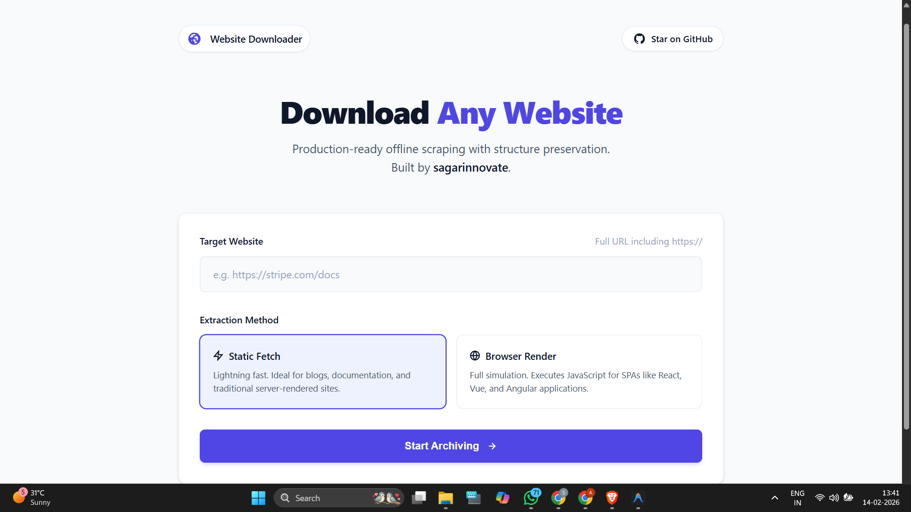
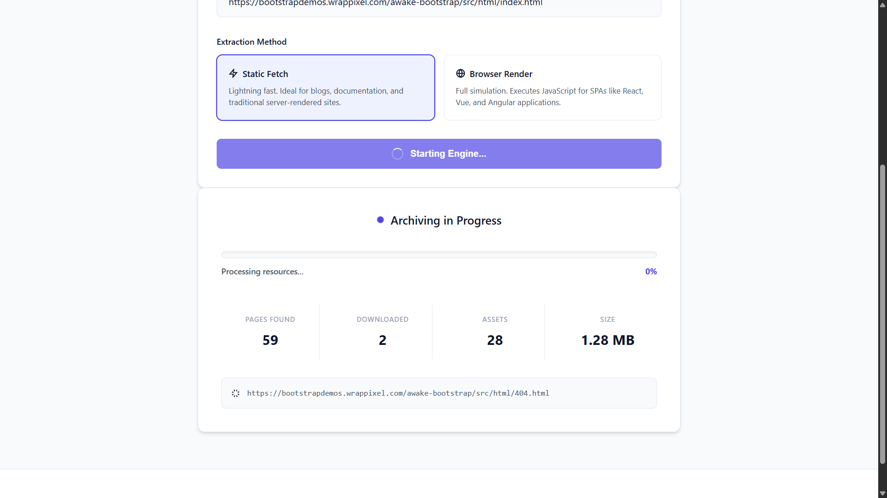
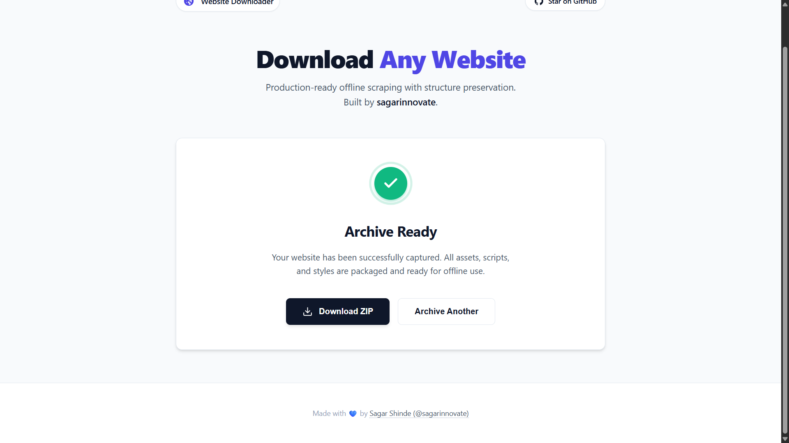

# 🌐 Website Downloader

A powerful, production-ready tool to download entire websites for offline viewing. Built with **React** and **Golang**, featuring real-time progress tracking, concurrent downloads, and intelligent asset extraction.

<div align="center">
  
  <br/><br/>
  
  <br/><br/>
  
</div>

## ✨ Features

### Core Functionality
- 🎯 **Dual-Mode Scraping** - Choose between **Fast Static** (HTML/CSS) or **Browser Mode** (React/Angular/Vue SPAs)
- 🌐 **SPA Support** - Uses headless Chrome to capture fully rendered web applications
- 📄 **Complete Offline Viewing** - Rewrites all links to relative local paths
- 🎨 **Asset Extraction** - Downloads CSS, JS, Fonts, Images, and media from **ANY domain**
- 📦 **Smart Packaging** - Creates a self-contained folder structure ready for offline use

### Advanced Features
- ⚡ **Concurrent Downloads** - Uses goroutines with worker pools for maximum speed
- 🔄 **Real-time Progress** - WebSocket-based live updates during scraping
- 🛡️ **Rate Limiting** - Configurable requests per second to avoid overwhelming servers
- ⚙️ **Configurable** - Customize depth, page limits, browser timeouts, and more

## 🚀 Quick Start

### Prerequisites
- **Go** 1.20 or higher
- **Node.js** 18 or higher
- **Chrome/Chromium** installed (for SPA mode)

### Installation

1. **Clone the repository**
```bash
git clone https://github.com/sagarinnovate/website-downloader.git
cd website-downloader
```

2. **Install backend dependencies**
```bash
cd backend
go mod download
```

3. **Install frontend dependencies**
```bash
cd ../frontend
npm install
```

### Running Locally

**Option 1: Using the test scripts (Recommended)**

Windows:
```bash
.\test.bat
```

Linux/Mac:
```bash
chmod +x test.sh
./test.sh
```

**Option 2: Manual startup**

Terminal 1 (Backend):
```bash
cd backend
go run main.go
```

Terminal 2 (Frontend):
```bash
cd frontend
npm run dev
```

Open http://localhost:5174 in your browser.

## 📖 Usage

1. **Enter a website URL** in the input field
2. **Select Mode:**
   - ⚡ **Fast (Static Sites):** Best for blogs, documentation, standard HTML sites
   - 🌐 **Browser (SPAs):** Essential for React, Angular, Vue, WordPress sites
3. **Click "Download Website"**
4. **Watch real-time progress** as it captures content and assets
5. **Download the ZIP** when complete
6. **Extract and open** `index.html` - works 100% offline!

## 🏗️ Project Structure

```
website-downloader/
├── backend/                    # Golang backend
│   ├── handlers/              # API endpoints
│   ├── scraper/               # Core scraping logic
│   │   ├── crawler.go        # URL crawling & logic
│   │   ├── browser_crawler.go# Headless browser (chromedp)
│   │   ├── link_rewriter.go  # Offline link rewriting
│   │   ├── downloader.go     # Asset downloading
│   │   ├── zipper.go         # ZIP packaging
│   │   └── job.go            # Job orchestration
│   ├── models/                # Data structures
│   ├── utils/                 # Utilities
│   ├── config.json           # Configuration
│   └── main.go               # Entry point
│
├── frontend/                  # React frontend
│   ├── src/
│   │   ├── components/       # UI components
│   │   ├── services/         # API client
│   │   └── App.jsx           # Main component
│   └── package.json
```

## ⚙️ Configuration

Edit `backend/config.json` to customize:

```json
{
  "maxDepth": 5,              // Maximum crawl depth
  "maxPages": 1000,           // Maximum pages to download
  "workerCount": 10,          // Concurrent download workers
  "requestTimeout": 30,       // Request timeout (seconds)
  "browserWaitTime": 5000,    // Time to wait for SPA rendering (ms)
  "browserTimeout": 60,       // Browser page load timeout (seconds)
  "rateLimit": 5,            // Requests per second
  "allowedExtensions": []     // Empty list = download ALL assets
}
```

## 🎯 What Gets Downloaded

When you download `https://example.com` in **Browser Mode**:

✅ **Included:**
- Fully rendered HTML (DOM snapshot)
- All CSS files (including sub-resources)
- All JavaScript files (bundled & chunks)
- External assets (Google Fonts, CDN scripts, images)
- Localized links (rewritten for offline use)

❌ **Excluded:**
- Navigation to different domains (only assets are downloaded from external domains)

## 🛠️ Technology Stack

### Backend
- **Language:** Go 1.20+
- **Framework:** Gin (HTTP server & routing)
- **HTML Parsing:** golang.org/x/net/html
- **WebSocket:** gorilla/websocket
- **Concurrency:** Goroutines with worker pools

### Frontend
- **Framework:** React 18
- **Build Tool:** Vite
- **HTTP Client:** Axios
- **Real-time:** Native WebSocket API
- **Styling:** Modern CSS

## 🤝 Contributing

Contributions are welcome! Please follow these steps:

1. Fork the repository
2. Create a feature branch (`git checkout -b feature/amazing-feature`)
3. Commit your changes (`git commit -m 'Add amazing feature'`)
4. Push to the branch (`git push origin feature/amazing-feature`)
5. Open a Pull Request

## 📝 License

This project is licensed under the MIT License - see the [LICENSE](LICENSE) file for details.

## 🙏 Acknowledgments

- Built with ❤️ using React and Golang
- Inspired by the need for reliable offline website viewing
- Thanks to all contributors!

## 📞 Support

If you encounter any issues or have questions:
- 🐛 [Report a Bug](https://github.com/sagarinnovate/website-downloader/issues)
- 💡 [Request a Feature](https://github.com/sagarinnovate/website-downloader/issues)
- 📧 GitHub: [@sagarinnovate](https://github.com/sagarinnovate)

## 🌟 Star History

If you find this project useful, please consider giving it a star! ⭐

---

**Made with 💙 by [Sagar Shinde](https://github.com/sagarinnovate)**
